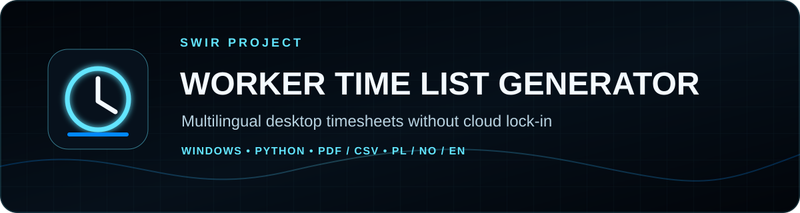

<!-- SWIR-README-STANDARD:v2 -->

<div align="center">



<br>


[](https://github.com/Swir)
[](https://github.com/Swir/Worker-Time-list-generator/stargazers)

[**Highlights**](#-highlights) · [**Quick Start**](#-quick-start) · [**PDF & CSV**](#-pdf--csv-workflows) · [**Releases**](#-releases)

</div>

<p align="center">
  
</p>

**Product roadmap progress:** N/A — this repository has no canonical checklist or weighted roadmap from which a truthful completion percentage can be reproduced.


## 📍 Project Status

| Item | Status |
|---|---|
| Current stage | Stable maintained desktop utility |
| Platform | Windows x64 release; Python source on supported desktop environments with Tk |
| Python | 3.10–3.14 in repository CI |
| Latest public release | [v3.1.0](https://github.com/Swir/Worker-Time-list-generator/releases/tag/v3.1.0) |
| Product roadmap | No canonical measurable roadmap in this repository |

## 🚀 Overview

**Worker Time List Generator** is an offline desktop application for recording work shifts and producing clean timesheets. It combines Polish, Norwegian and English interfaces in one application, calculates overnight work and configurable breaks, autosaves local data, and exports reusable CSV plus professional landscape PDF reports.

Version 3.1 restores useful workflows from the earlier V1/V2 line—undo, a dedicated PDF/table title, quick total-hours display and PDF-to-JPG conversion—without returning to separate per-language programs.

## ✨ Highlights

| Feature | What it does |
|---|---|
| 🌍 Multilingual UI | Detects Polish, Norwegian or English at first launch; unsupported system languages fall back to English. |
| 🕒 Shift calculation | Handles ordinary and overnight shifts with 0 / 30 / 45 / 60 minute break deduction. |
| ✅ Input repair | Validates date/time fields and offers one-click normalization for common mistakes. |
| ↩️ Undo workflow | `Ctrl+Z` restores recent table mutations such as add, update, delete, duplicate and import. |
| 💾 Local autosave | Stores runtime state in the current user's application-data directory instead of the repository. |
| 📄 PDF reporting | Exports landscape A4 reports with localized headers, totals, notes and optional per-client summaries. |
| 📊 CSV round trip | Imports and exports a stable work-record schema for backup and further processing. |
| 🖼️ PDF conversion | Converts generated PDF pages to PNG or JPG. |
| 📦 Windows delivery | Public release includes EXE, portable ZIP and SHA-256 checksum files. |

<div align="center">

</div>

## ⚙️ Quick Start

### Recommended — Windows release

Download the current release from:

[**Worker Time List Generator v3.1.0 →**](https://github.com/Swir/Worker-Time-list-generator/releases/tag/v3.1.0)

The release currently provides `WorkerTimeList.exe`, a Windows x64 portable ZIP and matching SHA-256 checksum files.

### From source

```bash
git clone https://github.com/Swir/Worker-Time-list-generator.git
cd Worker-Time-list-generator
python -m venv .venv
.venv\Scripts\activate
pip install -e .
python main.py
```

On Linux/macOS, activate the environment with:

```bash
source .venv/bin/activate
```

Check the installed version without opening the GUI:

```bash
python main.py --version
```

## 📋 Requirements / Compatibility

- Python **3.10+**; repository CI covers 3.10–3.14.
- A desktop Python installation with Tk support is required when running from source.
- The published packaged application targets **Windows x64**.
- Runtime data stays local; normal use does not require a network service.

## 🎮 Usage / Workflow

1. Enter the work date, client, start time and end time.
2. Select the break deduction and optionally add a note.
3. Add or update the row; overnight shifts such as `22:00 → 06:00` are supported.
4. Review the live total or use **Show total**.
5. Export the table to CSV or create the PDF report.

Useful shortcuts:

- `Ctrl+N` — add/update
- `Ctrl+S` — PDF export
- `Ctrl+Shift+S` — CSV export
- `Ctrl+Z` — undo
- `Delete` — remove selected row

## 📄 PDF & CSV Workflows

The application normalizes accepted dates to `YYYY-MM-DD` and times to `HH:MM`. The optional **PDF / table title** is used as the document heading, with the employee name available separately below it.

CSV exports contain:

```text
work_date, client, start, end, break_minutes, duration, note
```

The same schema can be imported back into the application.

Generated PDFs can also be converted to PNG or JPG for easier sharing.

## 🧠 Technology / Architecture

| Layer | Technology / role |
|---|---|
| Application | Python package under `src/worker_time_list/` |
| GUI | Tk / ttkbootstrap desktop interface |
| Reports | ReportLab PDF generation + PyMuPDF conversion |
| Images | Pillow |
| Local storage | JSON/state in the user application-data directory via platformdirs |
| Packaging | GitHub Actions + Windows executable/portable release workflow |

## 🗺️ Roadmap

<p align="center">
  
</p>

There is currently no authoritative checklist-style roadmap in this repository. Product completion is therefore intentionally reported as **N/A** rather than estimated from version numbers, commit count or test count.

## 📦 Releases

Latest verified public release:

- **v3.1.0** — Windows EXE, portable ZIP and SHA-256 files.

[**Browse all GitHub Releases →**](https://github.com/Swir/Worker-Time-list-generator/releases)

## 🔐 Data & Privacy

The application works offline. Autosave data is stored under the current user's application-data location, not in the repository or next to the executable. Existing v3.0 state is migrated to the v3.1 schema by the application.

## ⚠️ Limitations

- The published binary is a Windows x64 build; source execution on other desktop systems depends on local Python/Tk compatibility.
- PDF appearance depends on fonts and rendering support available to the environment.
- The progress SVG deliberately does not claim an application-completion percentage because no reproducible product roadmap exists.

## 🔎 Search Keywords

`work hours tracker windows` • `python timesheet desktop app` • `worker time list generator` • `multilingual timesheet PL NO EN` • `work hours PDF export` • `timesheet CSV import export` • `overnight shift calculator` • `employee hours report` • `reportlab timesheet` • `ttkbootstrap desktop app` • `offline work hours app` • `Windows timesheet EXE`


<div align="center">

### `LOG • CALCULATE • EXPORT • ARCHIVE`

⭐ **If this project is useful, consider leaving a star.**

[**← SWIR profile**](https://github.com/Swir) · [**All projects →**](https://github.com/Swir?tab=repositories)

</div>
